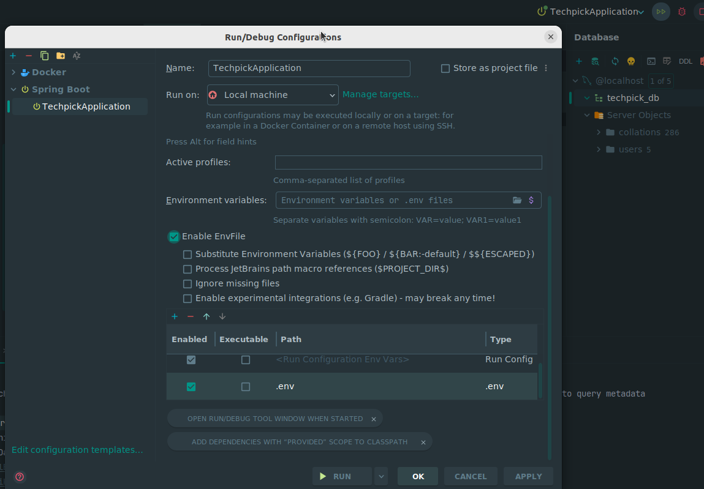

### 팀 개발 환경 가이드

#####  (0) JDK 버전
- JDK : `amazoncorretto:17`

#####  (1) 포매터 설정
- IntelliJ 설정
    - Code Formatter 설정
        - ./formatter 에 위치한 `naver-intellij-formatter.xml` 파일을 이용하여 설정
        - Settings -> CodeStyle -> Java -> Import Scheme
    - CheckStyle 설정
        - Plugin CheckStyle 설치
        - ./formatter 에 위치한 `naver-checkstyle-rules.xml` 파일을 이용하여 설정
        - suppression file 의 경우 `./.idea/naver-checkstyle-suppresssions.xml` 지정
    - Format-on-save 기능 활성화
        - Settings -> Tools -> Actions on Save -> Reformat code 체크

##### (2) Env 설정
1. `.env.sample` 파일로`.env`을 생성 합니다.
2. `run configuration` 설정에 아래와 같이 `.env` 파일을 추가 합니다.

